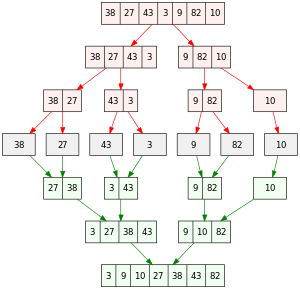

# Aula 02 - MergeSort

## O que é MergeSort?

É um algoritmo que se utiliza do princípio de dividir para conquistar. Ele vai fatiando o vetor em duas metades e depois volta organizando eles em forma ordenada.

